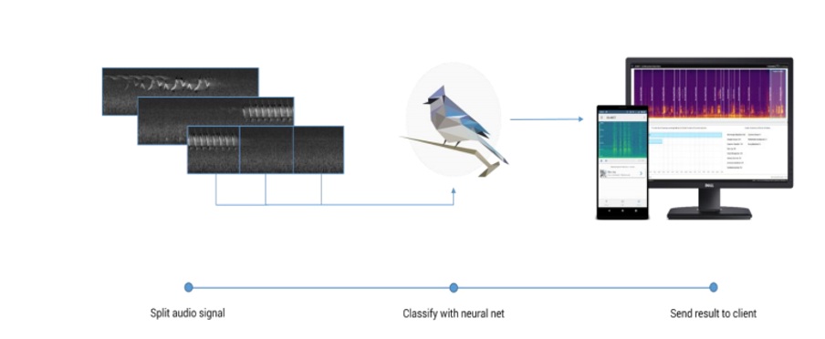
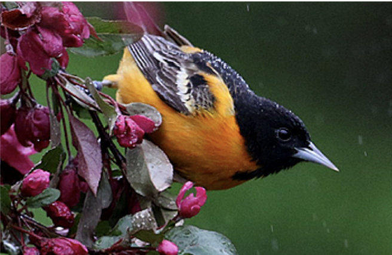

# Bird_Call_Identification

## THE MAIN OBJECTIVE OF THE PROJECT:
● Identifying bird species based on their calls, songs and sounds in audio recordings is an important task in wildlife monitoring for which the annotation is time consuming if done manually.
 
● Adapting those architectures for the purpose of audio event detection has become a common practice despite the very different domains of image.
 

## METHODOLOGY
  

This was a challenge presented by kaggle on May 2021: 
### Project:  Birdcall Identification
  
This is a kaggle competition with the deadline on June 1 2021, and $5,000 prize money. You are not required to complete the project before the kaggle  deadline for the exam, but you will not be allowed to use solutions from other kaggle participants as your exam project. In this competition, you’ll automate the acoustic identification of birds in soundscape recordings.  
You'll examine an acoustic dataset to build detectors and classifiers to extract the signals of interest (bird calls). Innovative solutions will be able to do  so efficiently and reliably.
[Kaggle](https://www.kaggle.com/c/birdclef-2021/overview)

